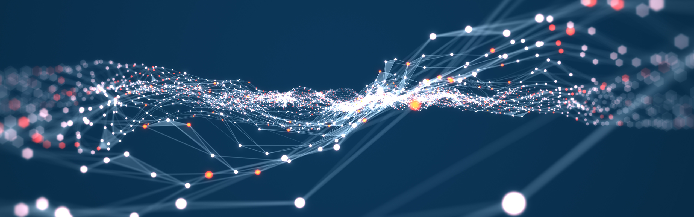

# Hi, I'm Nimish
**Cybersecurity Analyst | AI Enthusiast | Network Security Practitioner**

🔍 Passionate about securing systems, detecting threats, and automating defenses.  
💻 Hands-on with security tools like IBM QRadar, Microsoft Sentinel, Splunk, and Palo Alto firewalls.  
📚 Currently deepening my skills in **threat hunting** and **incident response**.  
🚀 Transitioning from a strong background in network engineering to a career in cybersecurity.

---

## 🔐 Skills & Tools
- **Security**: SIEM (QRadar, Sentinel, Splunk), Threat Intelligence, Incident Response Playbooks
- **Networking**: Cisco/Aruba switches, DHCP/DNS, VLAN segmentation, WAF configuration
- **Scripting**: Python automation, REST API integrations
- **Frameworks**: MITRE ATT&CK, NIST, ISO 27001

---

## 📜 Certificates
- [**Certified in Cybersecurity (CC) – ISC²**](https://www.credly.com/badges/28ac9728-81bd-4d59-bca9-686b4160a73b/)
- [**CompTIA Security+**](https://www.credly.com/badges/75b8caf8-b8a7-4706-a1b3-44fec79ecc4f/)

---

## 🌱 Current Focus
- Building SOC analysis playbooks
- Practicing with real-world datasets from security challenges & CTFs
- Contributing to open-source security tooling

---

## 📫 Connect with Me
[LinkedIn](https://www.linkedin.com/in/nimish-c-020642128/) | [Portfolio](https://github.com/NimishChalkar?tab=repositories)
